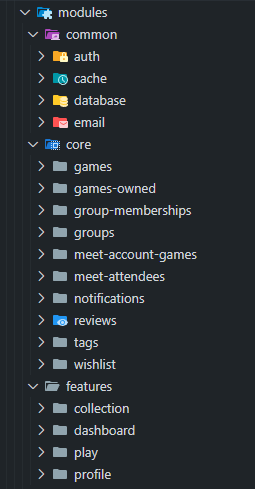

# BoardVault Architecture & Controllers Organization

BoardVault helps organize tabletop game nights by tracking your game collection, managing gaming groups, and planning gaming sessions. This document explains how we structure our NestJS backend, with a clear separation between core CRUD operations and extended logic endpoints.

---

## 1. Project Structure Overview

We follow a Domain-Driven Design (DDD) approach along with feature-based module organization. The project is divided into:

- **Core Modules:** Handle basic CRUD operations for individual entities.
- **Feature Modules:** Implement extended, cross-domain business logic.
- **Common Modules:** Provide shared functionality (database connection, authentication, etc.).

Below is a simplified folder structure:

```
src/
├── modules/
│   ├── core/                  # Core domain modules (basic CRUD operations)
│   │   ├── users/
│   │   │   ├── users.controller.ts   // Basic user CRUD endpoints
│   │   │   └── users.service.ts
│   │   ├── games/
│   │   ├── groups/
│   │   ├── meets/
│   │   └── ... 
│   │
│   ├── features/              # Extended logic endpoints across multiple domains
│   │   ├── dashboard/
│   │   │   ├── dashboard.controller.ts  // Extended endpoints for user-related game logic
│   │   │   └── dashboard.service.ts
│   │   ├── collection/
│   │   ├── play/
│   │   └── ...
│   │
│   │   # other modules
│   └── common/                # Shared modules (e.g., database, auth, email)
```

### Data Access Flow

We enforce a strict data access pattern throughout the application:

1. **Core modules** are the only modules with direct access to database and cache modules.
2. **Feature modules** must access data through core modules, never directly from the database or cache.

This creates a unidirectional flow of dependencies:
- For CRUD operations: `Controller → Core Module → Database/Cache`
- For feature operations: `Controller → Feature Module → Multiple Core Modules → Database/Cache`

This structure prevents circular dependencies and maintains clear separation of responsibilities.

---

## 2. Core Modules

**Core Modules** are responsible for handling the basics — creating, reading, updating, and deleting individual entities. They focus on a single domain entity, such as _users_, _games_, or _groups_.

### Example: Users Core Module

#### `modules/core/users/users.controller.ts`
```typescript
import { Controller, Get, Post, Param, Body } from '@nestjs/common';
import { UsersService } from './users.service';
import { CreateUserDto } from './dto/create-user.dto';

@Controller('users')
export class UsersController {
  constructor(private readonly usersService: UsersService) {}

  @Get(':id')
  async getUser(@Param('id') id: number) {
    return this.usersService.getUserById(id);
  }

  @Post()
  async createUser(@Body() createUserDto: CreateUserDto) {
    return this.usersService.createUser(createUserDto);
  }
  // Other basic CRUD endpoints
}
```

---

## 3. Feature Modules

**Feature Modules** are designed for extended logic that spans multiple domains. They inject services from the core modules to construct complex operations. Their focus is on business processes rather than simple CRUD.

### Example: Extended User Games Logic

#### `modules/features/dashboard/dashboard.controller.ts`
```typescript
import { Controller, Get, Param } from '@nestjs/common';
import { DashboardService } from './dashboard.service';

@Controller('dashboard')
export class DashboardController {
  constructor(private readonly dashboardService: DashboardService) {}

  @Get(':id/games/:gameId')
  async getUserGame(
    @Param('id') userId: number,
    @Param('gameId') gameId: number
  ) {
    return this.dashboardService.getUserGames(userId, gameId);
  }
  // Other extended endpoints such as reviews or invitations
}
```

#### `modules/features/dashboard/dashboard.service.ts`
```typescript
import { Injectable } from '@nestjs/common';
import { UsersService } from '../../core/users/users.service';
import { GamesService } from '../../core/games/games.service';
import { OwnedGamesService } from '../../core/owned-games/owned-games.service';

@Injectable()
export class DashboardService {
  constructor(
    private readonly usersService: UsersService,
    private readonly gamesService: GamesService,
    private readonly ownedGamesService: OwnedGamesService,
    // Other required core services
  ) {}

  async getUserGame(userId: number, gameId: number) {
    // This service orchestrates calls to multiple core services
    // but never accesses the database directly
    const user = await this.usersService.getUserById(userId);
    const game = await this.gamesService.getGameById(gameId);
    const ownership = await this.ownedGamesService.getOwnership(userId, gameId);
    
    // Combine and transform data
    return { user, game, ownership };
  }
}
```

### Integration Details

Both the **Core** and **Feature** controllers share a common base path (in this case `/users`). This means:
- Basic user operations, like `/users/:id`, are handled by `UsersController`.
- Extended operations, like `/users/:id/games/:gameId`, are handled by `UserGamesController`.

This approach provides a clear and intuitive API for consumers while keeping internal code responsibilities well separated.

---

## 4. Example: Get all groups of a user

Let's see a real example of how this works in practice.

We want a endpoint to get all groups of a user. This should return also, for each group, a complete list of its members and their games and reviews.

This, previously, was done in `users.service.ts`, that needed to import multiple other services and forcing a couple circular dependencies.



Now, we can do this in `features/dashboard.service.ts` by injecting the required `/core` services through the NestJS dependency injection system.

In this service, we import each `/core` service that we need to use. This allows later to build whatever complex structure the frontend may need, without having to manage any logic apart from the composition of the data.

Each individual service is responsible for accessing the database or cache depending of its needs, is responsible for parsing and validating the data against each Zod schema, declaring the DTOs and types, and so on.

```typescript
@Injectable()
export class DashboardService {
    constructor(
        private readonly usersService: UsersService,
        private readonly groupsService: GroupsService,
        private readonly groupMembershipsService: GroupMembershipsService,
        private readonly gamesOwnedService: GamesOwnedService,
        private readonly gamesService: GamesService,
        private readonly reviewsService: ReviewsService,
    ) {}

    @LogFeature(new Logger('DashboardService'))
    async getGroupsOfUser(userId: number): Promise<Array<GroupWithMembersAndGames>> {
        const memberships = await this.groupMembershipsService.getGroupMembershipsByAccountId(userId)
        const groupsWithMembers = await Promise.all(memberships.map(async membership => {
            // the group data
            const group = await this.groupsService.getGroupById(membership.groupId)
            // the members of the group
            const _memberships = await this.groupMembershipsService.getGroupMembershipsByGroupId(membership.groupId)
            const members: Array<GroupMemberWithGames> = await Promise.all(_memberships.map(async _membership => {
                const user = await this.usersService.getUserById(_membership.accountId)
                const gamesOwned = await this.gamesOwnedService.getGamesOwnedByAccountId(_membership.accountId)
                const games = await Promise.all(gamesOwned.map(game => this.gamesService.getGameById(game.gameId)))

                const userWithGames: UserWithGames = { ...user, games }
                const userReviews = await this.reviewsService.getGameReviewsByAccountId(_membership.accountId)

                return {
                    ...userWithGames,
                    joinedAt: _membership.joinedAt,
                    reviews: userReviews,
                }
            }))

            return { ...group, members }
        }))

        return groupsWithMembers
    }
}
```

---

## 5. Benefits of This Organization

- **Separation of Concerns:** Core modules focus solely on basic data operations, while feature modules encapsulate complex business logic.
- **Modularity:** The codebase remains organized, making it easier to maintain, test, and extend.
- **Flexible Routing:** Controllers can share a base path (e.g., `/users`), making API endpoints logical and consistent without forcing complex URL prefixes.
- **Decoupled Dependencies:** By using interfaces and dependency injection, extended logic is kept separate from basic CRUD operations.
- **Clear Data Access Pattern:** The enforced unidirectional data flow (feature → core → database) prevents circular dependencies and promotes clean architecture.

---

## 6. Extra: Event-Based Communication (Optional)

For additional decoupling, you might consider **event-based communication** as an option. This involves emitting events when specific actions occur (e.g., a user adds a game), allowing other parts of the system to react without a direct dependency. While not used in the current implementation, it's a strategy to explore if you need looser coupling in the future.

---

*This document provides an architectural overview and guides you through the logical separation of controllers and modules in the BoardVault backend. The chosen strategy helps maintain clarity and scalability in handling both simple and complex operations as the application grows.*
